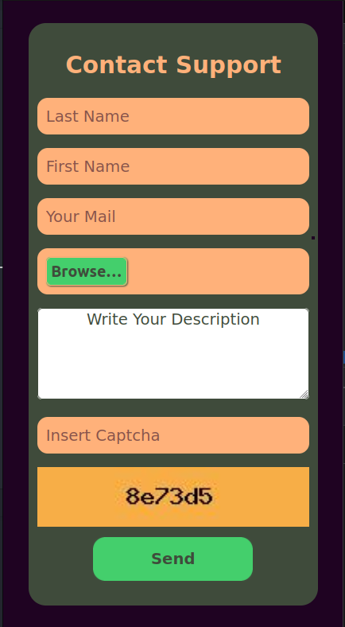

# Hackers Poulette

The company Hackers Poulette ™ sells Raspberry Pi accessory kits to build your own. They want to allow their users to contact their support team. Your mission is to create a fully-functioning online "contact support" form, in PHP. It must display a contact form and process the received answer (sanitize, validate, answer the user).


## Tech Stack

**Client:** Html , SASS

**Server:** Wamp , PHP , SQL


## Features

- Database with PDO connection
- The form's html code must be semantically valid and accessible
- In case of wrong input, the form should display a useful visual clue about the error, below the input field.
- The error message must be readable and helpful to users.
- The data has to be sanitised and validated (server side)
- Once the form is validated, the data should be send to the database.
- Spam prevention using captcha.


## Installation

Use composer install for the dependances.

```bash
  npm install composer
```
    
## Screenshots



